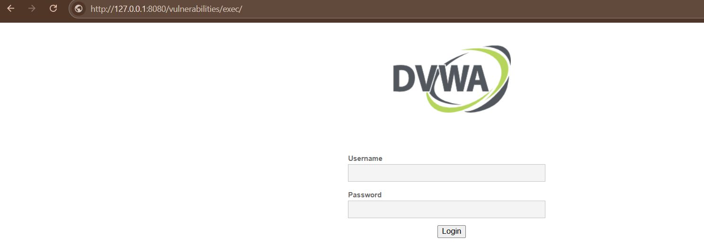
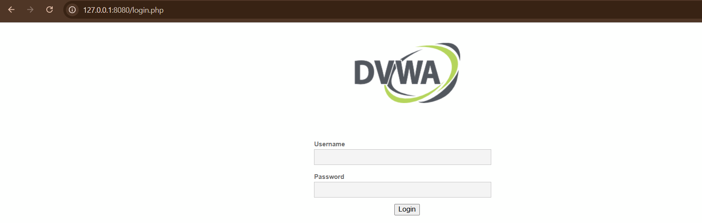
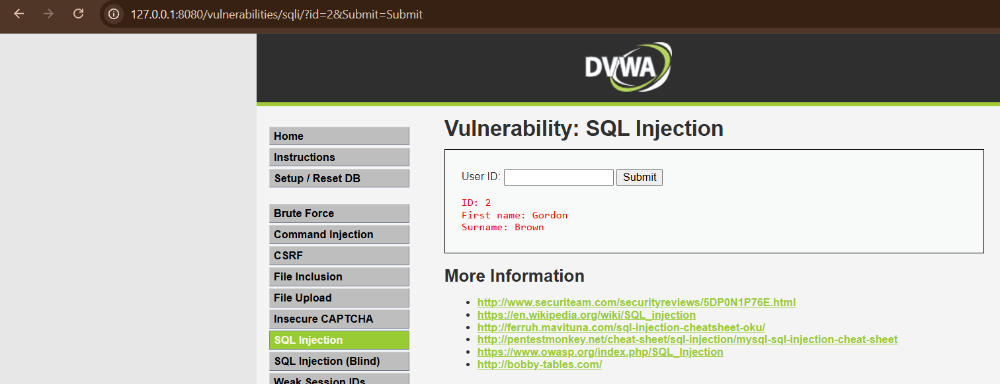
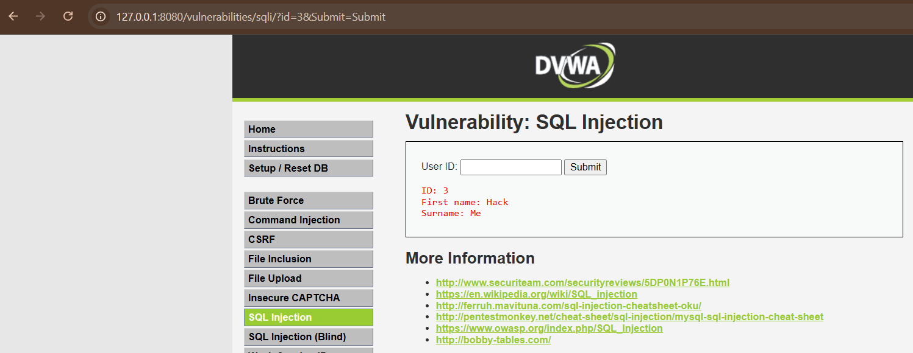

## 🎯 Penetration Testing — Broken Access Control / IDOR

[](https://github.com/andriyank/Penetration-Testing-Broken-Access-Control-IDOR/releases/tag/v1.0)

Authenticated black-box/grey-box penetration test evaluating whether a signature-based WAF (SafeLine) can detect and stop **Broken Access Control** vulnerabilities — specifically **Insecure Direct Object Reference (IDOR)** — on a deliberately vulnerable target (DVWA).
 
## 📋 Executive Summary
 
Two scenarios were tested against OWASP Top 10 **A01:2021 — Broken Access Control**:
 
| Test | Result |
|---|---|
| **Forced Browsing** (unauthenticated access to a protected module) | ✅ **Not Vulnerable** — blocked by the application's own session check |
| **IDOR** (accessing other users' data via a numeric `id` parameter) | ❌ **Vulnerable** — `admin` session could read other users' data by simply changing `?id=1` → `?id=2` → `?id=3`, with no server-side ownership check |
 
The WAF did **not** detect or block the IDOR requests — every request was syntactically valid HTTP traffic with no attack-pattern signature to match. This confirms a well-known limitation: **signature-based WAFs cannot detect business-logic flaws like IDOR**, since the vulnerability lies in missing authorization logic, not in the shape of the request.
 
**Overall Risk Rating:** High
**WAF detection rate on the confirmed finding:** 0%
### 📋 Table of Contents

[#-table-of-contents](#-table-of-contents)

- [Additional Setup: DVWA as Target](#additional-setup-dvwa-as-target)
- [Scenario 1 — Forced Browsing](#scenario-1--forced-browsing-missing-function-level-access-control)
- [Scenario 2 — IDOR](#scenario-2--idor-insecure-direct-object-reference)
- [WAF Detection Verification](#waf-detection-verification)
- [Analysis](#-analysis)
- [Updated Test Results Table](#-updated-test-results-table)
- [Full Report](#-full-report)
- [References](#-references)

---

### Additional Setup: DVWA as Target

To test the **Broken Access Control** vulnerability class, the target was switched from a static Python web server to **DVWA (Damn Vulnerable Web Application)**, since this vulnerability requires an application with an authentication/authorization system (login, session, role) — something a static file server does not have.

```
Laptop (Windows 11)
└── WSL2
    └── Kali Linux Rolling 2026.2
        └── Docker Engine
            └── SafeLine WAF (containers: mgt, tengine, detector, postgres, etc.)
                 │
                 ├── Listening Port: 8080 (HTTP)
                 │
                 └── Reverse Proxy ──► DVWA (port 9001)
```

```bash
sudo docker run -d --name dvwa -p 9001:80 vulnerables/web-dvwa
```

Initial setup:
1. Access `http://127.0.0.1:9001/setup.php` → **Create / Reset Database**
2. Log in (`admin` / `password`) at `http://127.0.0.1:9001/login.php`
3. Set **DVWA Security → Low**

SafeLine's upstream (**Applications → Test Web Demo → Basic**) was re-pointed from `http://127.0.0.1:8000` to `http://127.0.0.1:9001`, so DVWA became accessible through the reverse proxy at `http://127.0.0.1:8080`.

---

### Scenario 1 — Forced Browsing (Missing Function-Level Access Control)

**Payload/Test:**
```
1. Logout: http://127.0.0.1:8080/logout.php
2. Direct access without login: http://127.0.0.1:8080/vulnerabilities/exec/
```
<p align="center">
  
</p>

**Result:** The request was automatically redirected back to `login.php`. DVWA enforces a session check (`authenticated`) on every module page, so unauthenticated access was successfully prevented by the application itself (not by the WAF).

<p align="center">
  
</p>

**Conclusion:** ✅ Not Vulnerable — function-level access control works correctly.

---

### Scenario 2 — IDOR (Insecure Direct Object Reference)

**Payload/Test:**
Logged in as user `admin`, then accessed the SQL Injection module while sequentially changing the `id` parameter:

```
http://127.0.0.1:8080/vulnerabilities/sqli/?id=1&Submit=Submit
http://127.0.0.1:8080/vulnerabilities/sqli/?id=2&Submit=Submit
http://127.0.0.1:8080/vulnerabilities/sqli/?id=3&Submit=Submit
```
**Result:**

| Request | Data Returned |
| --- | --- |
| `id=1` | First name: `admin`, Surname: `admin` |
| `id=2` | First name: `Gordon`, Surname: `Brown` |
| `id=3` | First name: `Hack`, Surname: `Me` |

<p align="center">
  
</p>

<p align="center">
  
</p>

<p align="center">
  
</p>
Even though the request was sent by the `admin` session, the application returned other users' data based purely on the numeric `id` in the URL parameter — **with no check on whether that `id` actually belongs to the logged-in user.**

**Conclusion:** ❌ **Vulnerable — IDOR / Broken Access Control (CWE-639)**. Object references (`id`) are direct, sequential/guessable, and ownership is never verified server-side.

---

### WAF Detection Verification

**SafeLine WAF → Attacks** log for this test session:

| Action | URL | Attack Type |
| --- | --- | --- |
| Blocked | `?file=../../../../etc/passwd` | File Include |
| Blocked | `?id=1' OR '1'='1` | SQL Inj |
| Blocked | `?q=<script>alert(1)</script>` | XSS |
| — *(not logged)* | `?id=2&Submit=Submit` | — |
| — *(not logged)* | `?id=3&Submit=Submit` | — |

The `id=2` and `id=3` requests **do not appear at all** in the Attacks log — not because they were missed, but because syntactically the requests are entirely valid and contain no pattern recognized by signature-based detection.

---

### 📊 Analysis

SafeLine WAF, like most signature-based WAFs, works by matching request **patterns/payloads** (SQL characters, script tags, `../` sequences, etc.) against a predefined ruleset. This approach is effective against attack classes like **XSS, SQL Injection, and Path Traversal**, since their payloads inherently contain recognizable structures/characters.

**Broken Access Control and IDOR fall outside this detection scope**, because:

1. The request is **syntactically valid** — `?id=2` is an ordinary numeric parameter with no suspicious characters.
2. The flaw isn't in the request's *shape*, but in the **application's authorization logic** — specifically the missing check such as:
   ```
   if (requested_id != logged_in_user_id) {
       return 403 Forbidden
   }
   ```
3. A WAF has no business-logic context to know that "User A should not be able to view User B's data" — that responsibility belongs entirely to the application code.

**Implication:** A WAF is a strong defensive layer against payload-based attacks, but it is **not a substitute** for secure coding practices. Preventing IDOR/Broken Access Control must happen at the application layer, for example:
- Verify resource ownership server-side on every request (not just checking login status)
- Use indirect object references (random UUIDs) instead of easily guessable sequential IDs
- Consistently enforce role-based access control (RBAC) on every endpoint

---

### ✅ Updated Test Results Table

| Attack Type | Status | Detected As |
| --- | --- | --- |
| XSS | ✅ **Blocked** | XSS |
| SQL Injection | ✅ **Blocked** | SQL Inj |
| Path Traversal (via parameter) | ✅ **Blocked** | File Include |
| Forced Browsing | ✅ **Prevented** *(by the application, not the WAF)* | — |
| **IDOR / Broken Access Control** | ❌ **Not Detected / Not Prevented** | *(out of WAF scope — requires application-level code fixes)* |

---

## 📄 Full Report
 
The complete report — including scope, methodology (OWASP WSTG), CVSS scoring, attack narrative, and strategic recommendations — is available here:
 
📥 [**Pentest_Report_Broken_Access_Control_IDOR.pdf**](docs/Pentest_Report_Broken_Access_Control_IDOR.pdf) — view in repo
📦 [**Download from Releases (v1.0)**](https://github.com/andriyank/Penetration-Testing-Broken-Access-Control-IDOR/releases/download/v1.0/Pentest_Report_Broken_Access_Control_IDOR.pdf) — direct download link

### 📚 References

- [OWASP Top 10 — A01:2021 Broken Access Control](https://owasp.org/Top10/A01_2021-Broken_Access_Control/)
- [OWASP — Insecure Direct Object Reference (IDOR) Prevention Cheat Sheet](https://cheatsheetseries.owasp.org/cheatsheets/Insecure_Direct_Object_Reference_Prevention_Cheat_Sheet.html)
- [CWE-639: Authorization Bypass Through User-Controlled Key](https://cwe.mitre.org/data/definitions/639.html)
- [CWE-862: Missing Authorization](https://cwe.mitre.org/data/definitions/862.html)
- [DVWA — Damn Vulnerable Web Application (GitHub)](https://github.com/digininja/DVWA)
- [SafeLine WAF — Official Documentation](https://docs.waf.chaitin.com/en/GetStarted/Deploy)
- [SafeLine WAF — GitHub](https://github.com/chaitin/SafeLine)
